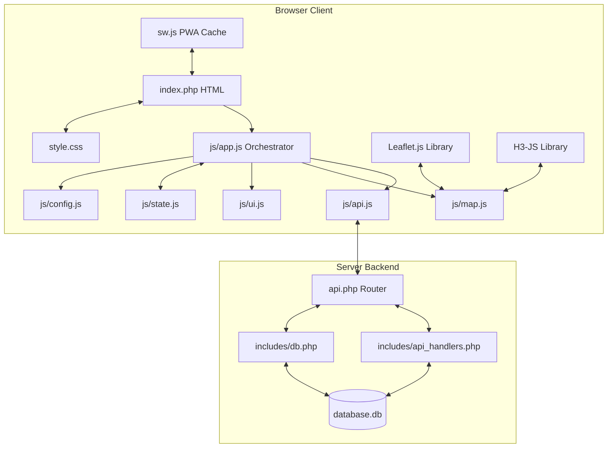

# HexTravel Log - AI Agent System Documentation ⬡🤖

This document provides a comprehensive technical overview and architecture guidelines for AI coding assistants working on the HexTravel Log repository.

---

## 🏗️ System Architecture

The project is structured with a clean separation of concerns between a PHP API/SQLite backend and a modular ES6 JavaScript frontend.

### Architecture Overview



---

## 🗄️ Database Schema & Migrations

The database is an SQLite instance managed through PDO. The schema, connections, and migrations are handled in `includes/db.php`.

### Database Tables

#### 1. `users`
Tracks individual user profiles.
- `id` (INTEGER, PRIMARY KEY, AUTOINCREMENT)
- `username` (TEXT, UNIQUE, NOT NULL)
- `created_at` (DATETIME, DEFAULT CURRENT_TIMESTAMP)

#### 2. `visited_hexes`
Tracks hexagonal regions visited by each user.
- `h3_index` (TEXT, NOT NULL)
- `user_id` (INTEGER, NOT NULL)
- `res` (INTEGER, NOT NULL)
- `knowledge_level` (INTEGER, DEFAULT 2)
- `added_at` (DATETIME, DEFAULT CURRENT_TIMESTAMP)
- **Primary Key**: `(h3_index, user_id)`
- **Foreign Key**: `user_id` references `users(id)`

### Migration Strategy
Migrations trigger automatically inside `initDatabase()` (in `includes/db.php`) on backend bootstrap.
- Standard tables initialization check (`CREATE TABLE IF NOT EXISTS`).
- Auto-migration check: If the `visited_hexes` table does not contain a `user_id` column, it automatically:
  1. Creates the `users` table.
  2. Creates a Default User.
  3. Renames the old `visited_hexes` to `visited_hexes_old`.
  4. Migrates data, referencing the new Default User.
  5. Drops the old table.

---

## 🔌 API Endpoints Reference

All requests route through `api.php`. Errors are returned in JSON format: `{"error": "Message"}`.

| Endpoint | Method | Params (Query / JSON Body) | Description | Response Example |
| :--- | :--- | :--- | :--- | :--- |
| `api.php?action=users` | `GET` | None | Fetch all users | `[{"id": 1, "username": "User"}]` |
| `api.php?action=users` | `POST` | `{"username": "name"}` | Create a new user | `{"success": true, "id": 2}` |
| `api.php` | `GET` | `?user_id=1` | Fetch visited hexes for user | `[{"h3_index":"881f...","res":8,"knowledge_level":2,"added_at":"..."}]` |
| `api.php` | `POST` | `{"h3_index": "...", "res": 8, "user_id": 1, "knowledge_level": 2}` | Add or update a hex | `{"success":true,"h3_index":"...","knowledge_level":2,"added_at":"..."}` |
| `api.php` | `DELETE` | `{"h3_index": "...", "user_id": 1}` | Remove a visited hex | `{"success": true, "removed": "..."}` |

---

## 💻 Frontend Architecture (ES6 Modules)

### 1. `js/config.js`
Contains global constant definitions such as default colors, styles, grid parameters, and the starting coordinates.
> [!IMPORTANT]
> If modifying default rendering values (e.g. line weights, fill colors, zoom thresholds), apply the changes here.

### 2. `js/state.js`
The single source of truth for runtime application state. Holds references to the active layers (`gridLayer`, `visitedLayer`), current theme, opacity levels, and current selected user profile.
- **State Properties**:
  - `visited`: `Map` storing active hexes `h3Index => { level, addedAt }`.
  - `currentUser`: `{ id, username }` (null initially).

### 3. `js/api.js`
A clean data-access layer utilizing `fetch`. It does not contain DOM manipulation or state mutations. It simply executes HTTP calls and returns promises resolving to JSON.

### 4. `js/ui.js`
Responsible for toast messages, UI panel classes, toggle selectors, and DOM node maps (`ELEMENTS` object cache). 

### 5. `js/map.js`
Contains all Leaflet initialization and math routines using `h3-js`.
- **H3 Calculations & Level of Detail (LOD)**:
  - Dynamically calculates active resolution based on zoom:
    ```javascript
    function getResForZoom(zoom) {
        if (zoom < 10) return 6;
        if (zoom <= 13) return 8;
        return 10;
    }
    ```
  - **LOD Aggregation**: When rendering `visitedLayer`, hexes stored at fine resolutions are visually aggregated to the current viewport's resolution parent (`h3.cellToParent`) to avoid rendering tiny, invisible polygons.
  - **Res 8 outlines contours**: Renders outline borders of Res 8 hex cells when zoom level >= 14 to give structural detail to the user.

### 6. `js/app.js`
The entrypoint that orchestrates the app lifecycle. It binds event listeners (Leaflet map events, DOM button clicks, PWA Service Worker registrar), delegates actions to sub-modules, and handles state mutations.

---

## 🛠️ Offline Support (PWA)

PWA support is driven by `sw.js`:
- **Cache Name**: `hextravel-vN` (increment `vN` when adding new offline resources to invalidate the old cache).
- **Cache-First Strategy**: Map tile assets fetched from `basemaps.cartocdn.com` or `openstreetmap.org` are cached locally.
- **Network-First Strategy**: API requests targeting `api.php`.
- **Stale-While-Revalidate**: General assets like HTML structure, CSS layouts, and JS modules.

---

## 📋 Rules & Guidelines for AI Agents

When implementing new features or making edits, adhere to the following guidelines:

1. **State Mutation**: Never update Leaflet elements directly without updating the raw `state.visited` Map first. Maintain `state.visited` as the single source of truth.
2. **API Separation**: Keep `js/api.js` pure. Do not write DOM updates or import rendering routines inside `js/api.js`.
3. **Database Security**: Always use prepared statements via PDO (`$db->prepare` & `$stmt->execute`) inside `includes/api_handlers.php` to prevent SQL injection.
4. **PWA Cache Invalidation**: If you modify any JS, CSS, or manifest files, increment the cache version string (`CACHE_NAME`) in `sw.js` to prompt client updates.
5. **No Tailwind**: Do not introduce Tailwind CSS. Keep styling clean and optimized inside `style.css` using custom properties.
6. **Optimistic Rendering**: The app uses optimistic UI updates (e.g. rendering hexes immediately upon interaction and requesting network database saves asynchronously). Ensure this pattern is maintained to prevent layout lag.
